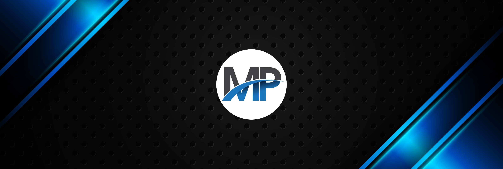
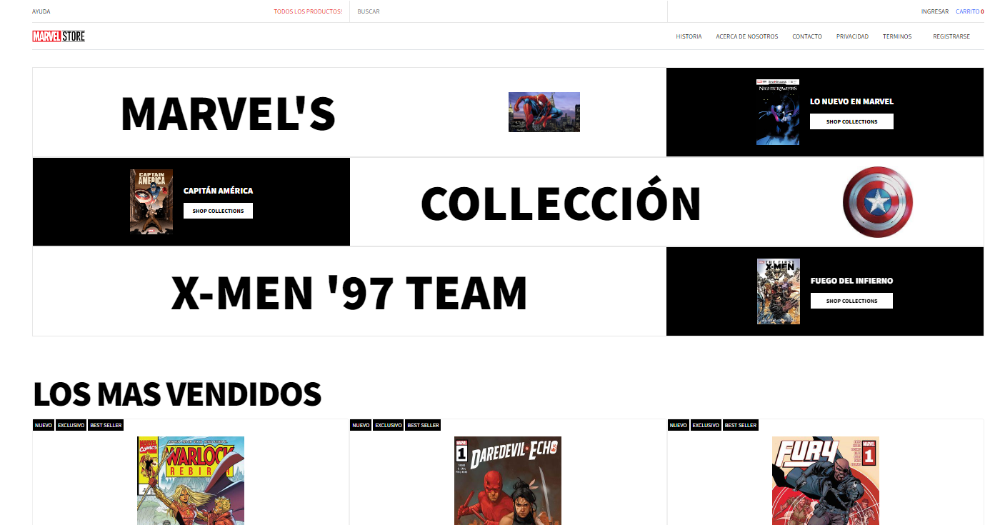
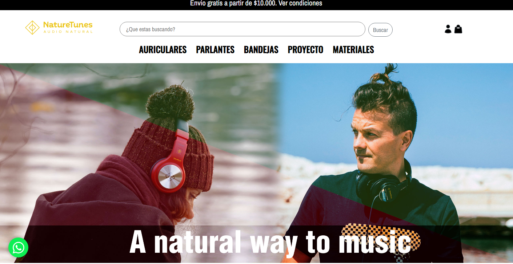
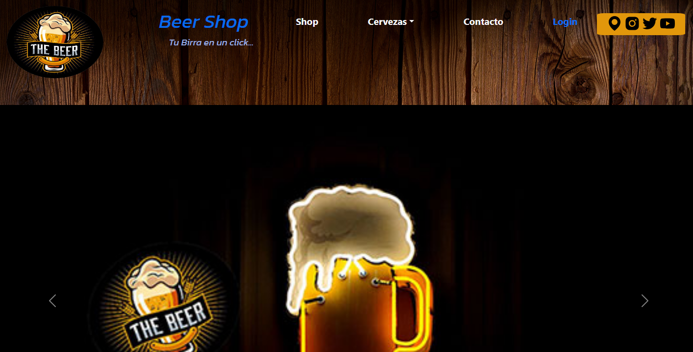

<!-- 

<h1 align="center">Hola, soy <a href="https://aristi.dev">Max Developer</a> 👋</h1>

 -->
<h1 align="center">
    
</h1>

<!-- 

 -->
 

 
  &nbsp;&nbsp;
  &nbsp;&nbsp;
  <a href="https://max-porfolio.vercel.app/" target="_blank">
      <!-- sqlite, safari, google-chrome are other good icon options -->
  </a>

 

## About me

- ⭐ Github Star ⭐ 
- 📲 Mobile developer
- 🎥 Te enseño a programar apps en [Youtube](https://youtube.com/aristidevs?sub_confirmation=1) (+33k subs)
- ✏️ Y por escrito en [CursoKotlin](https://cursokotlin.com)
- 📗 Autor del libro [Iniciación a Android en Kotlin. Casos prácticos](https://www.paraninfo.es/catalogo/9788428340922/iniciacion-a-android-en-kotlin--casos-practicos)
- 🧑‍🏫 Creador de [AppCademy](https://appcademy.dev)
 

<h2 align="center">⭐ My Proyects ⭐</h2>
  
<table>

<tr>
<td width="100%">
<h3 align="center">Marvel Shop 🤖</h3>

 
&nbsp;&nbsp;

Sitio web E-comerce de Comics<strong> MARVEL</strong> -  Aplicacion totalmente funcional, con base de datos Creada en MondoDB, tanto para administrar usuarios, como los productos en venta. Contiene carro de Compras y es totalmente responsivo para todas los dispositivos.

</td>
</tr>
</table>

<table>
<tr>
<td width="100%">
<h3 align="center">Nature Tunes</h3>

                                       

  

&nbsp;&nbsp;

Sitio web E-comerce de productos de Sonido de la firma <strong> NATURE TUNES</strong> -  Aplicacion totalmente funcional, con base de datos Creada en MYSQL, tanto para administrar usuarios, como los productos en venta. Contiene carro de Compras y es totalmente responsivo para todas los dispositivos..

                                                             

</td>
</tr>
</table>

<table>
<tr>
<td width="100%">
<h3 align="center">BEER SHOP</h3>

 
&nbsp;&nbsp;

Aprende a programar aplicaciones <strong>Android con Kotlin nivel intermedio</strong> - En este curso nos centraremos en las <strong>buenas prácticas, arquitectura y testing</strong>. Curso <strong>GRATUITO de 8 horas</strong> con todo el código disponible para descargar.

</td>                                                    
</tr>
</table>                                                                                 

 

  

  <h2>🚀 Contributions 🚀</h2>
    
  
  
     

<h2 align="center">⚡ Stats ⚡</h2>
  

<!-- <h2 align="center">⚡ Stats ⚡</h2>
 

  
  
   
  

 -->

  

<h3 align="center">
    
</h3>

 
